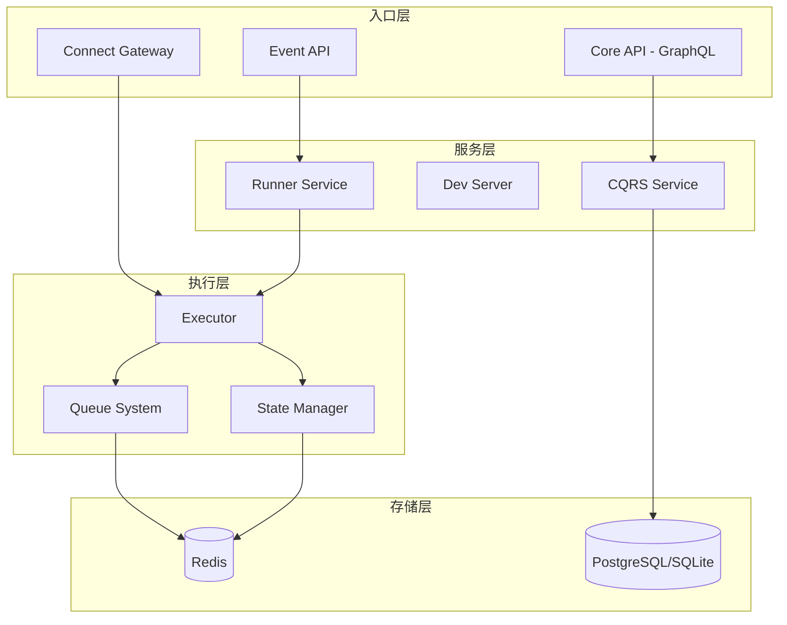
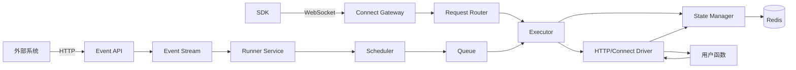

# Inngest Rust 重构项目 - 主要文档

## 📋 项目概述

本文档是 Inngest Go 项目向 Rust 重构的主要指导文档。Inngest 是一个事件驱动的持久化执行平台，目前主要用 Go 语言实现。我们计划用 Rust 完全替代 Go 实现，以获得更好的性能、内存安全性和并发控制能力。

### 🎯 重构目标

- **性能提升**: 利用 Rust 零成本抽象特性，提升系统处理性能
- **内存安全**: 消除内存相关 bug 和安全漏洞
- **并发优化**: 利用 Rust ownership 系统实现更安全的并发
- **维护性**: 通过强类型系统减少运行时错误
- **兼容性**: 保持与现有系统 100% 兼容

### 📚 文档结构

本重构项目包含以下核心文档：

| 文档 | 描述 | 用途 |
|------|------|------|
| **[INNGEST_ARCHITECTURE_ANALYSIS.md](./INNGEST_ARCHITECTURE_ANALYSIS.md)** | 项目架构深度分析 | 理解现有系统架构和组件关系 |
| **[INNGEST_COMPONENT_DETAILS.md](./INNGEST_COMPONENT_DETAILS.md)** | 核心组件详细分析 | 深入了解各组件实现细节 |
| **[RUST_REWRITE_STRATEGY.md](./RUST_REWRITE_STRATEGY.md)** | Rust 重构策略与计划 | 具体的实施计划和技术选型 |

## 🏗️ 系统架构概览

### 核心组件架构



### 数据流架构



## 🚀 重构实施路线图

### 阶段划分 (共 8 个开发阶段)

| 阶段 | 主要内容 | 关键交付物 |
|------|----------|------------|
| **第1阶段** | 基础设施建设 | 项目结构、核心数据结构、CI/CD |
| **第2阶段** | 状态管理系统 | Redis 状态管理、Lua 脚本迁移 |
| **第3阶段** | 队列系统 | 高性能队列、流控功能 |
| **第4阶段** | 执行引擎 | 核心执行器、驱动系统 |
| **第5阶段** | 服务层 | API 层、Runner 服务 |
| **第6阶段** | Connect 系统 | WebSocket 网关、消息路由 |
| **第7阶段** | CQRS 和开发服务器 | 系统集成、开发工具 |
| **第8阶段** | 测试和优化 | 性能优化、文档完善 |

### 🎯 关键里程碑

- **里程碑 1** (第2阶段结束): 状态管理系统完全兼容
- **里程碑 2** (第4阶段结束): 核心执行引擎可用
- **里程碑 3** (第6阶段结束): 完整功能验证
- **里程碑 4** (第8阶段结束): 生产就绪

## 🛠️ 技术选型

### 核心技术栈

| 组件 | 选择 | 理由 |
|------|------|------|
| **异步运行时** | `tokio` | 成熟稳定，生态完善 |
| **HTTP 框架** | `axum` | 类型安全，高性能 |
| **数据库** | `sqlx` | 编译时检查，支持多数据库 |
| **Redis 客户端** | `fred` | 高性能，Cluster 支持 |
| **WebSocket** | `tokio-tungstenite` | tokio 生态集成 |
| **序列化** | `serde` | 生态成熟，性能优秀 |
| **错误处理** | `anyhow + thiserror` | 标准实践 |

### 项目结构

```
inngest-rust/
├── crates/
│   ├── inngest-core/          # 核心数据结构和 trait
│   ├── inngest-state/         # 状态管理
│   ├── inngest-queue/         # 队列系统
│   ├── inngest-executor/      # 执行引擎
│   ├── inngest-api/           # HTTP API
│   ├── inngest-connect/       # Connect 系统
│   ├── inngest-runner/        # Runner 服务
│   ├── inngest-cqrs/          # CQRS 系统
│   ├── inngest-devserver/     # 开发服务器
│   └── inngest-cli/           # CLI 工具
├── tests/                     # 集成测试
├── proto/                     # Protobuf 定义
└── docs/                      # 文档
```

## ⚡ 性能优化方向

- **事件处理吞吐量**: 利用 Rust 异步特性优化事件处理管道
- **队列延迟**: 通过零成本抽象减少队列操作开销
- **内存使用**: 通过 ownership 系统优化内存管理
- **CPU 使用**: 利用编译时优化减少运行时开销
- **启动时间**: 优化服务启动流程和依赖加载

## 🔒 兼容性保证

### 数据兼容性
- **Redis 数据格式**: 完全兼容现有格式
- **数据库 Schema**: 保持现有表结构
- **消息格式**: 保持序列化格式一致

### 协议兼容性
- **HTTP API**: 端点和响应格式 100% 兼容
- **WebSocket**: Protobuf 协议完全兼容
- **配置格式**: 支持现有配置文件

### 运行时兼容性
- **SDK 兼容**: 所有现有 SDK 无需修改
- **部署兼容**: 支持现有部署脚本
- **监控兼容**: 保持现有监控指标

## 🎯 重要注意事项

### 开发优先级

1. **兼容性优先**: 任何时候都不能破坏与现有系统的兼容性
2. **核心功能优先**: 状态管理和执行引擎是最高优先级
3. **性能基准**: 每个阶段都要满足性能基准要求
4. **测试覆盖**: 单元测试覆盖率 > 85%，集成测试 > 90%

### 风险管控

- **技术风险**: 重点关注 Connect 协议兼容性和 Redis Lua 脚本
- **进度风险**: 分阶段交付，设置缓冲时间
- **质量风险**: 严格的代码审查和测试流程

### 成功标准

- [ ] 功能完整性: 所有核心功能完整实现
- [ ] 性能指标: 建立完整的性能评估体系
- [ ] 兼容性: 与现有系统 100% 兼容
- [ ] 质量指标: 满足测试覆盖率要求

## 📖 如何使用这些文档

### 对于项目经理
1. 查看本文档了解项目概览
2. 参考 [RUST_REWRITE_STRATEGY.md](./RUST_REWRITE_STRATEGY.md) 制定详细计划
3. 使用里程碑跟踪项目进度

### 对于架构师
1. 深入研读 [INNGEST_ARCHITECTURE_ANALYSIS.md](./INNGEST_ARCHITECTURE_ANALYSIS.md)
2. 理解现有系统的设计模式和数据流
3. 基于架构分析进行 Rust 设计

### 对于开发工程师
1. 从 [INNGEST_COMPONENT_DETAILS.md](./INNGEST_COMPONENT_DETAILS.md) 了解具体实现
2. 参考技术选型进行 Rust 实现
3. 严格遵循兼容性要求

### 对于测试工程师
1. 基于组件分析设计测试用例
2. 重点关注兼容性测试
3. 建立性能基准测试

## 🔄 持续更新

这些文档会随着项目进展持续更新。请定期检查更新内容，确保团队使用最新的指导信息。

---

**最后更新**: $(date)  
**文档版本**: 1.0  
**项目状态**: 策划阶段

> 💡 **提示**: 开始实施前，建议所有团队成员都完整阅读这些文档，确保对项目有统一的理解。 